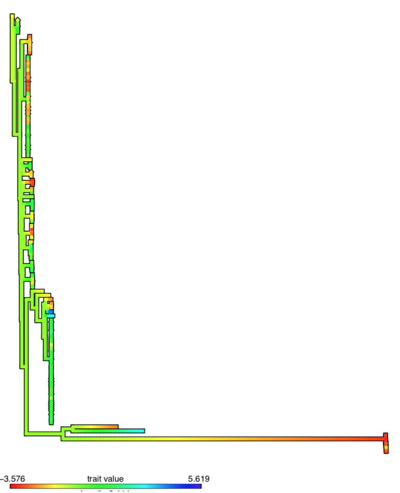
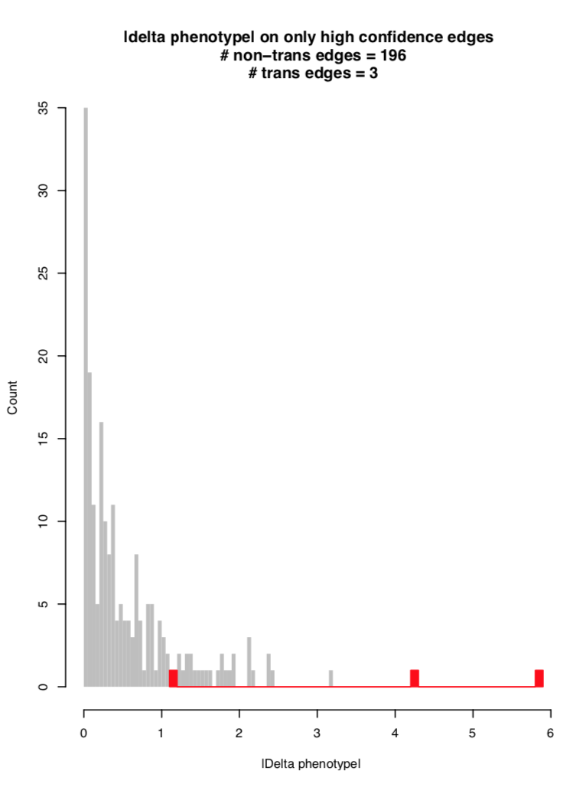
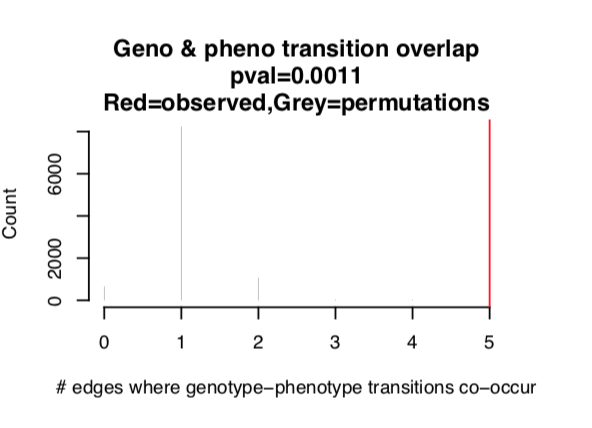

```{r, echo = FALSE, message = FALSE}
knitr::opts_chunk$set(collapse = TRUE, comment = "#>")
library(hogwash)
```

Bacterial GWAS are the application of the GWAS method, pioneered in humans since the 2000s, to bacterial genomes. Bacterial genomes present different pros and cons that human genomes when applying GWAS methods. Bacteria have clonal populations, so it's easy to identify false positives when associating genetic loci with phenotypes. It is critical to control for population structure during association testing.

The hogwash package makes it straight forward to test for associations between the presence of genetic viarants and a binary or continuous phenotype. 

This document introduces you to the three hogwash methods and shows you how to run the code on your computer. 

# How hogwash works   
This package reads in one phenotype (either continuous or binary), a matrix of binary genotypes, and a phylogenetic tree. Given these inputs it performs an ancestral reconstruction of that phenotype and each genotype. The ancestral reconstructions are used to perform one of several tests to associate the the genotypes with the phenotype: 

1. Continuous Test
2. Synchronous Test
3. PhyC 
  
Once a test finishes running it returns data to summarize the results, including a P-value for each tested genotype, and plots of the data.

### Grouping 
A unique feature of hogwash is the ability to organize genotypes into biologically meaningful groups. Testing for an association between an individual SNP and a phenotype is quite stringent, but patterns may emerge when grouping together biologically related genotypes. For example, grouping together all variants (insertions, deletions and SNPs) within a gene or promoter region could allow the user to identify a particular gene as being associated with a phenotype while any individual variant within that gene may not have deep penetrance in the isolates being tested. Grouped genotypes could have increased power to identify convergent evolution because they captures larger trends in functional impact at the group level and reduce the multiple testing correction burden. Use cases for this method could be to group SNPs into genes, kmers or genes into pathways, etc... Each of the three tests can be run on disaggregated data or aggregated data with the inclusion of a grouping key which is described later. 

### A note on nomenclature: 
#### Talking about phylogenetic trees: 

* Nodes: bifurcation points   
* Tips: termini  
* Edges: the line defined by two adjacent nodes or a tip and the nearest node

```{r, echo = FALSE, out.width = "700px"}
knitr::include_graphics("tree_with_nomenclature_for_wiki.png")
```

#### Convergent evolution vs parallel evolution:
While convergent evolution and parallel evolution have specific meanings, those definitions are often interchanged. For the purposes of this software package, I prefer to call all episodes of independent evolution of a trait "convergence." 

## All tests start with ancestral reconstruction & confidence
### Ancestral reconstruction
Given a phylogenetic tree and trait for each tree tip an ancestral reconstruction is created wherein the value of the trait at each internal node is predicted. To learn more about the ancestral reconstruction tool please read the [ape::ace() documentation](https://www.rdocumentation.org/packages/ape/versions/5.3/topics/ace). Ancestral reconstruction for binary characters is performed with maximum likelihood and either an equal rates or all rates different model (the best model is chosen for each reconstruction).  
  
Binary phenotype: 
```{r, echo = FALSE, out.width = "700px", }
knitr::include_graphics("ancestral_reconstruction.png")
```

From the ancestral reconstruction above we may infer that antibiotic resistance evolved three separate times: 

1. Ancestor to t1 & t9
2. Ancestor to t7
3. Ancestor to t2 & t6 
  
### Confidence
A tree edge is excluded from analysis if it: 

* has low bootstrap support (default: < 70%),
* is very long (>10% of total tree edge length),
* or has low ancestral reconstruction support (maximum likelihood < .875) from either the phenotype or genotype reconstruction. 

## 1. Continuous test (input: continuous phenotype)
### Does the phenotype change more than expected by chance on genotype transition edges than on genotype non-transition edges?

Genotype transitions are defined as any edge where the parent node and child node are not equal. 

| Genotype edge type | parent node value | child node value |   
|-|-|-|
| Transition | wild type (0) | mutant (1) |  
| Transition | mutant (1) | wild type (0) |  
| Non-transition | wild type (0) | wild type (0) |  
| Non-transition | mutant (1) | mutant (1) |  

```{r, echo = FALSE, out.width = "700px", }
knitr::include_graphics("both_transition_edges.png")
```

The absolute value of the phenotype change on each edge is measured. Then the distributions of the delta phenotype on genotype transition edges versus non-transition edges are compared.  

```{r, echo = FALSE, out.width = "700px", }
knitr::include_graphics("continuous_algorithm_demo.png")
```

Left panel: the delta phenotype is noticeably higher on transition edges (purple), suggesting an association between a change in the genotype and a change in the phenotype. Right panel: the two delta phenotype distributions are nearly identical, suggesting the genotype transitions are not associated with phenotype changes.    

The sum of delta phenotype on only genotype transition edges calculated. Then a permutation test is performed wherein the classification of each edge as a genotype transition or non-transition edge is randomized. The new sum of delta phenotype on the permuted genotype transition edges is calculated. An empirical p-value is calculated based on the observed vs. permuted sums.

## 2. Synchronous test (input: binary phenotype)
### Do genotype transitions occur more often than expected by chance on phenotype transition edges than on phenotype non-transition edges?
This test is an extension of PhyC (see below), but with the goal of requiring a more stringent association between the genotype and phenotype. The number of edges on the tree where both a genotype transition and phenotype transition occurs is calculated. Then a permutation test is run where the classification of edges as genotype transition edges are randomized on the tree. The number of edges where the permuted genotype transitions coincide with the phenotype transition is recorded for each permutation, creating a null distribution. An empirical p-value is calculated based on the observed number of edges as compared to the null distribution. 

Transition edges are defined as in (1.) but phenotypes, which are now binary, are also classified in this way:

| Genotype or phenotype edge type | parent node value | child node value |   
|-|-|-|
| Transition | wild type (0) | mutant (1) |  
| Transition | mutant (1) | wild type (0) |  
| Non-transition | wild type (0) | wild type (0) |  
| Non-transition | mutant (1) | mutant (1) |  


```{r, echo = FALSE, out.width = "700px", }
knitr::include_graphics("both_transition_edges.png")
```

## 3. PhyC (input: binary phenotype)
### Does the genotype transition from wild type to mutant more often than expected by chance on edges where the phenotype is present than where the phenotype is absent?  
This test is my implementation of the PhyC algorithm* as described in [Farhat et al.’s 2013 Nature Genetics paper](https://www.ncbi.nlm.nih.gov/pmc/articles/PMC3887553/). If a genotype mutates more often on edges with the phenotypic trait of interest, there is a positive correlation between the genotype mutation and the phenotype. This approach controls for population structure by requiring the overlap of the phenotype with the genotype transition, rather than the overlap of the phenotype presence with genotype presence. 

The number of edges on the tree where both a genotype mutates (0 -> 1) and the phenotype is present occurs is calculated. Then a permutation test is run where the genotype mutations (0 -> 1) are randomized on the tree. The number of edges where the permuted genotype mutation (0 -> 1) coincides with the phenotype transition is recorded for each permutation, creating a null distribution. An empirical p-value is calculated based on the observed number of edges as compared to the null distribution. 

Edges definitions are as follows: 
* Genotype: the only genotype edges of interest are edges where a mutation appears. 
* Phenotype: rather than consider changes in the phenotype, only consider the presence or absence of the phenotype on each edge. 

| Genotype edge type | parent node value | child node value |   
|-|-|-|
| Transition | wild type (0) | mutant (1) |  
| Other | mutant (1) | wild type (0) |  
| Other | wild type (0) | wild type (0) |  
| Other | mutant (1) | mutant (1) | 


| Phenotype edge type | Phenotype **edge** value |   
|-|-|
| Present| mutant (1) |  
| Absent | wild type (0) |  

*Note: Our implementation of PhyC has some changes from the original: 
* PhyC was originally implemented with Bonferroni multiple test correction, but this implementation uses False Discovery Rate.
* Hogwash reduces the multiple testing burden by testing only those genotype-phenotype pairs for which convergence is detectable; genotypes fewer than 2 transition edges are excluded and genotype-phenotype pairs with fewer than 2 edges where the genotype transition overlaps with phenotype presence are assigned a P-value of 1. 
* Ancestral reconstruction for genotypes and phenotypes was performed using only maximum likelihood (the original PhyC used multiple approaches). 
* Users only supply one phylogenetic tree to hogwash instead of three. 
Largely, these changes were implemented to make hogwash fast and easy to use. 

## Comparing the three tests: 

|                  | Phenotype | Genotype | Question|  
|---------------|----------------|---------------|-------------| 
| Continuous | Continous. Absolute value of phenotype change on each edge.  | Transition edges: node unequal. Non-transition edges: nodes equal. | Does the phenotype change more than expected on genotype transition edges than on genotype non-transition edges?| 
| Synchronous | Discrete. Transition edges: nodes unequal. Non-transition edges: nodes equal. | Transition edges: nodes unequal. Non-transition edges: nodes equal. | Do genotype transitions occur more often than expected on phenotype transition edges than on phenotype non-transition edges? |   
| PhyC | Discrete. Ancestral reconstruction edge value: phenotype is 1 or 0. | Transition edges: parent node == 0 & child node == 1 | Does the genotype transition from wild type (0) to mutant (1) more often than expected by chance on phenotype present (1) edges than phenotype absent (0) edges? |  

## Data

Load data for Continuous Test: 
```{r}
growth_phenotype <- hogwash::growth
snp_genotype <- hogwash::snp_genotype
tree <- hogwash::tree
key <- hogwash::snp_gene_key

```

Load phenotype data for the Synchronous Test & PhyC 
```{r}
antibiotic_phenotype <- hogwash::antibiotic_resistance
```

A brief overview of the types of input data for hogwash: 
## Required data
### Phenotype
The required structure of the phenotype data object is a matrix. The rows correspond to samples and should be ordered to match the tips of the phylogenetic tree. There should only be one column, which contains the phenotype data. The matrix should have both row names and column names. The row names must exactly match the tree’s tip labels. The phenotype can either be binary (0/1) or continuous. At this time hogwash **does not** support multiple categorical phenotypes (eg. ‘A’, ‘B’, & ‘C’).

Discrete phenotype:  

|                  | Antibiotic_resistance |   
|---------------|---------------------------|  
| sample_1 | 0 |   
| sample_2 | 0 |   
| sample_3 | 1 |  
| sample_4 | 1 |  

Continuous phenotype:  

|                  | Toxin_production |   
|---------------|-------------------------|  
| sample_1 | 0.10 |   
| sample_2 | 1.20 |   
| sample_3 | 0.05 |  
| sample_4 | 2.70 |    

### Genotype
The required structure of the genotype data object is a matrix. The rows correspond to samples and should be ordered to match the tips of the phylogenetic tree. The columns correspond to individual genotypes. The matrix should have both row names and column names. The row names must exactly match the tree’s tip labels. Genotypes can be SNPs (core genome), genes (accessory genome) or other types (indels, pathways, etc...). Genotypes must be coded in binary (0/1).  
Genotype:  

|                  | SNP_1 | SNP_2 | SNP_3 | SNP_4 | SNP_5 |         
|---------------|-----------|-----------|-----------|------------|-----------|      
| sample_1 | 0 | 1 | 1 | 0 | 0 |  
| sample_2 | 0 | 0 | 0 | 1 | 1 |  
| sample_3 | 1 | 0 | 0 | 1 | 0 |  
| sample_4 | 1 | 1 | 1 | 0 | 1 |  
   

### Phylogenetic tree
The phylogenetic tree should be rooted. You can check if your tree is rooted by running: 
```{r}
ape::is.rooted(tree)
```
This will return a logical (TRUE OR FALSE).  

If the tree is not rooted, either:  

* root the tree either to an outgroup and then remove the outgroup from the tree, phenotype, and genotype (in this example assume tip t4 is the outgroup)  
* use the midpoint rooting method and reorder your phenotype and genotype to the new order
* or supply it to hogwash and the function will midpoint root the tree automatically. 

The tree must be fully bifurcating. I recommend building your phylogenetic tree with an outgroup, root using the outgroup, and then remove the outgroup prior to running hogwash. 


```{r, echo = FALSE, out.width = "700px", }
knitr::include_graphics("tree_with_nomenclature_for_wiki.png")
```

## Optional data
### Grouping genotypes key
hogwash allows the user to create ancestral reconstructions for individual genotypes and then condense them into meaningful groups. 

Requiring that an individual SNP occur in multiple lineages may be too stringent, but instead if all relevant SNPs from a gene are grouped together the power to identify convergent evolution will be increased because this grouping method could capture larger trends in functional impact at the gene level and a reduce the multiple testing correction burden. Use cases for this method could be to group SNPs into genes or genes into pathways. 

The required structure of the grouping genotypes key data object is a matrix. Each row corresponds to a genotype. The first column must have the name of a genotype included in the genotype matrix. The second column must have a name for a group to which the item in the first column belongs. Row names are not required. The column names are used in output plots and therefore must be included. 
  
|  SNP   | GROUP     |           
|----------|--------------|      
|SNP_1 | GENE_A |   
|SNP_1 | PATH_A | 
|SNP_2 | GENE_A |  
|SNP_3 | GENE_B |  
|SNP_4 | GENE_C |   
|SNP_5 | GENE_A |   
|SNP_6 | GENE_D |   
|SNP_6 | PATH_A |   

### Permutation number  
The default value is 10,000.
  
### False discovery rate  
The default value is 0.15.   
  
### Bootstrap support value confidence threshold  
The default value is 0.70 based on the value found in [Farhat et al’s 2013 Nature genetics paper](https://www.ncbi.nlm.nih.gov/pmc/articles/PMC3887553/). However, think carefully about the bootstrap confidence threshold you choose. For example, IQ-TREE is an increasingly popular method by which to create phylogenetic trees. The ultrafast bootstrap (UFBoot) support values are not the same as normal bootstrap support values. [UFBOOT support values are only considered high confidence for >= 0.95.](http://www.iqtree.org/doc/Frequently-Asked-Questions)


## Run hogwash

Run the Continuous Test: 
```{r, eval=FALSE}
hogwash(pheno = growth_phenotype, 
        geno = snp_genotype,  
        tree = tree)
```
The results of running the Continuous Test are now saved in two documents: 

* hogwash_continuous_TODAYS_DATE.pdf

* hogwash_continuous_TODAYS_DATE.rda


Run the Continuous Test but group SNPs from the same gene together. 
```{r, eval=FALSE}
hogwash(pheno = growth_phenotype, 
        geno = snp_genotype,  
        tree = tree, 
        group_genotype_key = key)
```
The results of running the Continuous Test with grouped genotypes are now saved in two documents: 

* hogwash_continuous_grouped_TODAYS_DATE.pdf

* hogwash_continuous_grouped_TODAYS_DATE.rda

Run the Synchronous Test & PhyC 
```{r, eval=FALSE}
hogwash(pheno = antibiotic_phenotype, 
        geno = snp_genotype,  
        tree = tree, 
        test = "both)
```
The results of running the  Synchronous Test & PhyC are now saved in four documents: 

* hogwash_synchronous_TODAYS_DATE.pdf

* hogwash_synchronous_TODAYS_DATE.rda

* hogwash_phyc_TODAYS_DATE.pdf

* hogwash_phyc_TODAYS_DATE.rda

Run the Synchronous Test & PhyC but group SNPs from the same gene together. 
```{r, eval=FALSE}
hogwash(pheno = antibiotic_phenotype, 
        geno = snp_genotype,  
        tree = tree, 
        group_genotype_key = key, 
        test = "both)

```
The results of running the  Synchronous Test & PhyC with grouped genotypes are now saved in four documents: 
* hogwash_synchronous_grouped_TODAYS_DATE.pdf

* hogwash_synchronous_grouped_TODAYS_DATE.rda

* hogwash_phyc_grouped_TODAYS_DATE.pdf

* hogwash_phyc_grouped_TODAYS_DATE.rda

You can run just one of the two discrete tests by change the `test = "both"` to either `test = "phyc"` or `test = "synchronous"`. 

## Interpreting the results
The pdf file contains all of the plots while the rda file contains all of the statistics, results, and tables. 

# Plots

## All three tests: 
Each test will return a .pdf with at least a Manhattan plot of the genetic loci (x-axis) vs. the -ln(p-value) (y-axis). The horizontal red line is the threshold for significance provided by the user (default FDR = 0.15), with significant loci appearing above the line.
  
  
```{r, echo = FALSE, out.width = "700px", }
knitr::include_graphics("2019-06-16_fqR_roary_convergence_test.png")
```

## Continuous test output plots: for only significant hits
### Phenotype
The ancestral reconstruction of the continuous phenotype. 

```{r, echo = FALSE, out.width = "500px", }

```


### Genotype
Ancestral reconstruction of the genotype on the tree and the tree with the transition edges identified. 
```{r, echo = FALSE, out.width = "500px", }
knitr::include_graphics("Genotype_transitions.png")
```


### Change in phenotype on each edge. 
4 plots to describe the change of phenotype on tree edges.

1. Histogram of phenotype change on all tree edges and only on high confidence edges.  
2. Histogram of the absolute value in the change of the phenotype on genotype transition edges vs. genotype non-transition edges.  
```{r, echo = FALSE, out.width = "500px", }

```

3. Histogram of the raw value in the change of the phenotype on genotype transition edges vs. genotype non-transition edges. 
4. The observed KS test statistic with the null distribution of KS test statistics derived from the permutations.  
```{r, echo = FALSE, out.width = "500px", }
knitr::include_graphics("KS_null_distribution.png")
```

### 
In cases where at least two loci were significant a heat map will be created. Each column is a named genotype. Each row corresponds to an edge on the tree. The heat map describes the genotype by edge. 1 (black) = transition edge. 0 (white) = non-transition edge. NA (grey) = low confidence (neither transition nor non-transition edge).  
```{r, echo = FALSE, out.width = "400px", }
knitr::include_graphics("ordered_by_tree_edge.png")
```

  
## Binary phenotype test output plots
In cases where at least two loci were significant a heat map will be created. Each column is a named genotype. Each row corresponds to an edge on the tree.  

The heat map describes the genotype by edge:  

- 1 (black) = transition edge  
- 0 (white) = non-transition edge  
- NA (grey) = low confidence 

### Column annotations:  

- FDR corrected, -ln(p-value) (purple)
- Locus: whether or not the p-value is significant after multiple test correction. (Not significant in white, significant in blue)
- Optional: Number of genetic loci included in the group (only appears when genotype is grouped according to a user provided key)

### Row annotations: 

#### Synchronous Test 
* Phenotype transition  
  * 1 (dark green) = transition edge  
  * 0 (light green) = not a transition edge  
  * -1 (white) = NA. NA indicates that the edge is low confidence and therefore cannot be characterized as either transition or non-transition edge.  

```{r, echo = FALSE, out.width = "500px", }
knitr::include_graphics("synchronous_grouped_genotype_summary_heatmap.png")
```


For each significant locus three plots are created: 

1. Phenotype transitions  
```{r, echo = FALSE, out.width = "500px", }
knitr::include_graphics("synchronous_phenotype_transitio.png")
```

2. Genotype transitions  
```{r, echo = FALSE, out.width = "500px", }
knitr::include_graphics("synchronous_genotype_transition.png")
```

3. Synchronicity of genotype transition and phenotype transitions with the null distribution generated from the permutations.  
```{r, echo = FALSE, out.width = "500px", }

```

##### PhyC: 

* Phenotype presence or absence   
    * 1 (dark green) = present   
    * 0 (light green) = absent  
    * -1 (white) = NA. NA indicates that the edge is low confidence and therefore cannot be characterized as either present or absent.  

For each significant locus three plots are created: 

1. Phenotype ancestral reconstruction  
```{r, echo = FALSE, out.width = "500px", }
knitr::include_graphics("phenotype_binary_reconstruction.png")
```

2. Genotype transition  
```{r, echo = FALSE, out.width = "500px", }
knitr::include_graphics("convergence_genotype_reconstruction.png")
```

3. Convergence of genotype transition (0 &rightarrow; 1) and phenotype presence (1) with the null distribution generated from the permutations.  
```{r, echo = FALSE, out.width = "500px", }
knitr::include_graphics("convergence_null_distribution.png")
```


# .rda file
This rdata file contains multiple types of data objects. 
## Continuous phenotype output (Continuous Test) 
- `hogwash_continuous$log` A description of your R environment  
- `hogwash_continuous$no_convergence_genotypes` A character vector with the names of genotypes excluded from both ancestral reconstruction and testing. These genotypes were excluded because either the genotype was absent in all or all but 1 samples or was present in all or all but 1 sample.  
- `hogwash_continuous$hit_pvals` The FDR corrected p-value for each genotype tested.   
- `hogwash_continuous$sig_pvals` The FDR corrected p-value for only genotypes significantly associated with the genotype.  
- `hogwash_continuous$hi_confidence_transition_edge` A list of numeric vectors. Each vector corresponds to the a tested genotype. The vectors are ordered by tree edges. High confidence genotype transition edges are indicated by 1, low confidence by 0.  
- `hogwash_continuous$num_hi_conf_transition_edge` Named numeric vector with the total number of high confidence genotype transition edges for the respective genotype.  
- `hogwash_continuous$dropped_genotypes` A character vector with the names of genotypes removed from testing because they did not have at least two high confidence genotype transition edges.  
- `hogwash_continuous$genotype_transition_edge` Matrix. Rows correspond to tree edges. Columns correspond to tested genotypes. Encoding: 
  - 0 == not a transition edge  
  - 1 == transition edge where parent node is 0 and child node is 1  
  - -1 == transition edge where parent node is 1 and child node is 0  
  - NA == low confidence edge     
- `hogwash_continuous$phenotype_transition_edges` Matrix. Rows correspond to tree edges. Values are the absolute change in the phenotype on that tree edge.  
- `hogwash_continuous$delta_pheno_table` A list of names matrices. Each tested genotype has a matrix that describes the sum of the absolute value in phenotype change on each of the following types of tree edges: genotype 0 &rightarrow; 1, genotype 1 &rightarrow; 0, and no change in genotype (either 0 &rightarrow; 0 or 1 &rightarrow; 1).  
Example:  
 
| | sum(\|delta phenotype\|) |
| - | - |
|geno_parent_0_child_1  |                 0.88|
|geno_parent_1_child_0  |                 0.00|
|geno_no_change |                        80.08|


- `hogwash_continuous$delta_pheno_list` A list of named lists. Each sublist corresponds to one tested genotype. The sublist has three numeric vectors: `$geno_parent_0_child_1`, `$geno_parent_1_child_0`, and `hogwash_continuous$geno_no_change.` Each value in the vector the is absolute value of phenotype change for an edge of that category. The edge values are not in any particular order. 

## Binary phenotype output (both Synchronous & PhyC) 
The prefix will be either hogwash_synchronous or hogwash_phyc, as appropriate. 

- `$log` A description of your R environment  
- `$no_convergence_genotypes` A character vector with the names of genotypes excluded from both ancestral reconstruction and testing. These genotypes were excluded because either the genotype was absent in all or all but 1 samples or was present in all or all but 1 sample.  
- `$contingency_table` A list of matrices. Each tested genotype has a corresponding contingency table.  
  - Synchronous: Relationship between the genotype not/transition and phenotype not/transition on each tree edge.   
  - Continuous: Relationship between the genotype not/transition and phenotype presence/absence on each tree edge.   
- `$hit_pvals` The FDR corrected p-value for each genotype tested.   
- `$sig_pvals` The FDR corrected p-value for only genotypes significantly associated with the genotype.  
- `$hi_confidence_transition_edge` A list of numeric vectors. Each vector corresponds to the a tested genotype. The vectors are ordered by tree edges. High confidence genotype transition edges are indicated by 1, low confidence by 0.  
- `$num_hi_conf_transition_edge` Named numeric vector with the total number of high confidence genotype transition edges for the respective genotype.  
- `$dropped_genotypes` A character vector with the names of genotypes removed from testing because they did not have at least two high confidence genotype transition edges.  
